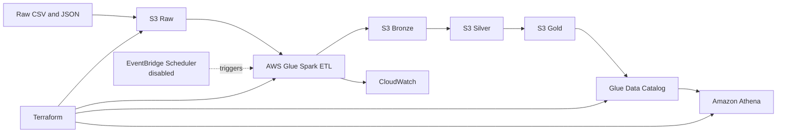
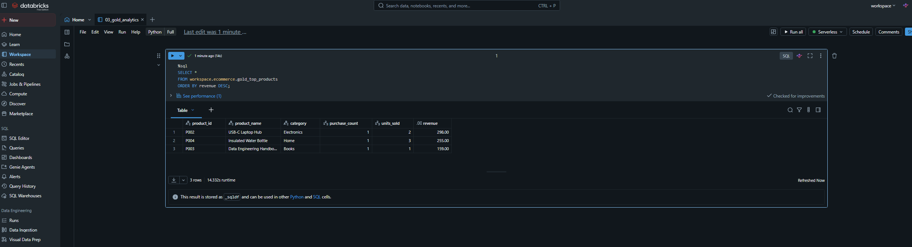
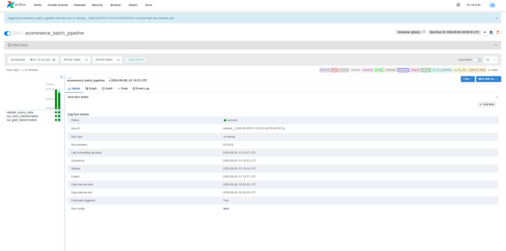

# Real-Time E-commerce Data Platform

An end-to-end data engineering project that turns raw e-commerce events into
analytics-ready tables using a Bronze, Silver, and Gold medallion architecture.

The project is implemented locally with Python, PySpark, Kafka, and Airflow;
validated in Databricks with Delta Lake; and deployed on AWS with Terraform.

## Architecture

## Highlights

- Built a medallion lakehouse: Raw → Bronze → Silver → Gold.
- Created Databricks Delta tables for ingestion, cleaning, and analytics.
- Deployed an AWS data lake using Terraform, S3, Glue, Athena, CloudWatch,
  IAM, EventBridge Scheduler, and an AWS Budget guardrail.
- Implemented local streaming and orchestration patterns with Kafka and
  Airflow.
- Added automated GitHub Actions tests.

## Verified analytics

The AWS Glue pipeline completed successfully and Athena queried the Gold layer.

| Product | Category | Units sold | Revenue |
| --- | --- | ---: | ---: |
| USB-C Laptop Hub | Electronics | 2 | 298.00 |
| Insulated Water Bottle | Home | 3 | 255.00 |
| Data Engineering Handbook | Books | 1 | 159.00 |

## Technology

`Python` · `PySpark` · `Delta Lake` · `Databricks` · `Apache Kafka` ·
`Apache Airflow` · `AWS S3` · `AWS Glue` · `Athena` · `CloudWatch` ·
`Terraform` · `GitHub Actions`

## Repository guide

| Path | Purpose |
| --- | --- |
| `data/raw` | Synthetic source data used by the pipeline |
| `src` | Local ingestion, transformation, Spark, and logging code |
| `notebooks` | Databricks Bronze, Silver, and Gold notebooks |
| `dags` | Airflow orchestration DAG |
| `terraform/aws` | AWS infrastructure and Glue ETL job |
| `tests` | Data-quality and Spark transformation tests |
| `docs` | Data model, Databricks runbook, and screenshot checklist |

## Evidence

The latest GitHub Actions workflow passed. AWS deployment and Athena evidence
were verified after Terraform applied the infrastructure and Glue completed a
manual Medallion run.

Databricks Gold analytics output:

Local Airflow orchestration success:

## Security and cost

All committed datasets are synthetic. The repository excludes credentials,
Terraform state, local environment files, private keys, and generated data.
Read [SECURITY.md](SECURITY.md) before contributing.

The AWS schedule and optional MSK cluster remain disabled to avoid unnecessary
costs while learning.

## Interview summary

> I built an end-to-end e-commerce data platform using a medallion
> architecture. Raw CSV and JSON events are ingested into Bronze, cleaned and
> typed in Silver, then aggregated into Gold analytics. I implemented the
> pattern locally, validated it in Databricks with Delta Lake, and deployed it
> on AWS using Terraform, S3, Glue, Athena, CloudWatch, IAM, and cost controls.
