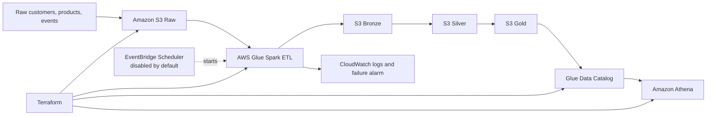

# Real-Time E-commerce Data Platform

An end-to-end data engineering portfolio project that turns raw e-commerce
events into reliable analytics tables. It demonstrates the medallion pattern
locally, in Databricks Delta Lake, and on AWS managed services.

> **Status:** deployed and verified on AWS and Databricks Free Edition. The
> AWS schedule and optional MSK cluster are disabled to control cost.

## What this project demonstrates

- CSV and JSON ingestion into Bronze, Silver, and Gold data layers.
- PySpark transformations, data-quality checks, and Delta Lake tables.
- Local Kafka and Airflow orchestration patterns.
- Terraform infrastructure as code.
- AWS S3, Glue, Athena, EventBridge Scheduler, CloudWatch, IAM, and budgets.

## Architecture



Databricks follows the same flow:

```text
Raw volume → Bronze Delta tables → Silver cleaned Delta tables → Gold analytics
```

## Verified results

The AWS Glue Medallion job completed successfully in **65 seconds**. Athena
then queried the Gold layer successfully.

| Top product | Category | Units sold | Revenue |
| --- | --- | ---: | ---: |
| USB-C Laptop Hub | Electronics | 2 | 298.00 |
| Insulated Water Bottle | Home | 3 | 255.00 |
| Data Engineering Handbook | Books | 1 | 159.00 |

| Environment | Evidence |
| --- | --- |
| Databricks Free Edition | Bronze and Silver tables built; Gold analytics generated |
| AWS | S3 lake, Glue ETL, catalog, Athena, CloudWatch, IAM, and budget guardrail deployed |
| AWS Glue | Manual Medallion run succeeded |
| Athena | `gold_top_products` query succeeded |

## Repository structure

```text
data/raw/                    Small CSV and JSON source dataset
src/                         Local Kafka, Python, Spark, and Delta jobs
notebooks/                   Databricks Bronze, Silver, and Gold notebooks
dags/                        Airflow DAG definition
terraform/aws/               Deployed AWS infrastructure and Glue job
terraform/                   Optional GCP learning blueprint
tests/                       Data integrity and transformation tests
docs/                        Data model, Databricks runbook, screenshot guide
```

## Data layers

| Layer | Purpose | Example output |
| --- | --- | --- |
| Raw | Immutable source-like files | `customers.csv`, `products.csv`, `events.json` |
| Bronze | Minimal transformation and ingestion lineage | `bronze_events` |
| Silver | Typed, cleaned, deduplicated records | `silver_events` |
| Gold | Business-ready aggregates | `gold_top_products` |

## Run locally

```bash
python -m venv .venv
.venv\\Scripts\\activate
pip install -r requirements.txt
python -m unittest discover -s tests -v
python src/processing/transform_to_silver.py
python src/processing/transform_to_gold.py
```

Generate larger reproducible sample data when practising:

```bash
python src/generators/generate_raw_data.py --customers 100 --products 25 --events 1000 --seed 7
```

## Databricks workflow

Upload the raw source files to:

```text
/Volumes/workspace/ecommerce/raw/raw/
```

Run these notebooks in order:

1. `notebooks/01_bronze_ingestion.py`
2. `notebooks/02_silver_transformations.py`
3. `notebooks/03_gold_analytics.py`

They create Delta tables under the `workspace.ecommerce` schema. See the
[Databricks runbook](docs/databricks-runbook.md) for table names, row counts,
and expected Gold output.

## AWS deployment

[`terraform/aws`](terraform/aws) provisions:

- Private S3 buckets for the lake and Athena results.
- Glue database and Gold external tables.
- Glue 4.0 Spark ETL that writes Bronze, Silver, and Gold Parquet layers.
- Athena workgroup, CloudWatch logs/failure alarm, and least-privilege IAM.
- A $20 monthly AWS Budget guardrail.
- An EventBridge Scheduler schedule at 03:00 UTC, disabled by default.

MSK Serverless is optional and disabled because it is the highest-cost part.

```powershell
terraform -chdir=terraform/aws init
terraform -chdir=terraform/aws plan
terraform -chdir=terraform/aws apply
```

Query the Gold table with Athena:

```sql
SELECT product_id, product_name, category, purchase_count, units_sold, revenue
FROM gold_top_products
ORDER BY revenue DESC;
```

> Review Terraform plans before applying. AWS Budgets alerts about spend; it is
> not a hard spending cap.

## Local streaming and orchestration

- `compose.yaml`: local Kafka configuration.
- `src/ingestion/producer.py` and `consumer.py`: event producer/consumer with
  `event_id` duplicate handling.
- `dags/ecommerce_pipeline.py`: `source validation → Silver → Gold` Airflow
  dependency chain.
- `src/processing/delta_demo.py` and `delta_time_travel.py`: Delta Lake demos.

```bash
docker compose up -d
docker compose ps
docker compose down
```

## Screenshots and evidence

GitHub screenshots should prove the running system, not just show source code.
The capture order and exact filenames are in
[docs/screenshots/README.md](docs/screenshots/README.md).

After capture, put images in `docs/screenshots/` and add them here:

<!--


-->

## Interview summary

> I built an end-to-end e-commerce data platform using a medallion
> architecture. Raw CSV and JSON data is ingested into Bronze, cleaned and
> typed in Silver, and aggregated into Gold analytics tables. I implemented
> the pattern locally with Python, Spark, Kafka, and Airflow; validated it in
> Databricks with Delta tables; then deployed an AWS version with Terraform,
> S3, Glue, Athena, CloudWatch, IAM, and cost controls. I verified a Glue run
> and queried the final Gold data through Athena.

## Cost and cleanup

The EventBridge schedule and MSK are disabled by default. S3, Glue Catalog,
CloudWatch, and AWS Budgets can still have small usage-based charges.

When finished, run this from the same Terraform state location used for the
deployment:

```powershell
terraform -chdir=terraform/aws destroy
```

Review the destroy plan before approving it. It removes project AWS resources
and their stored data.
